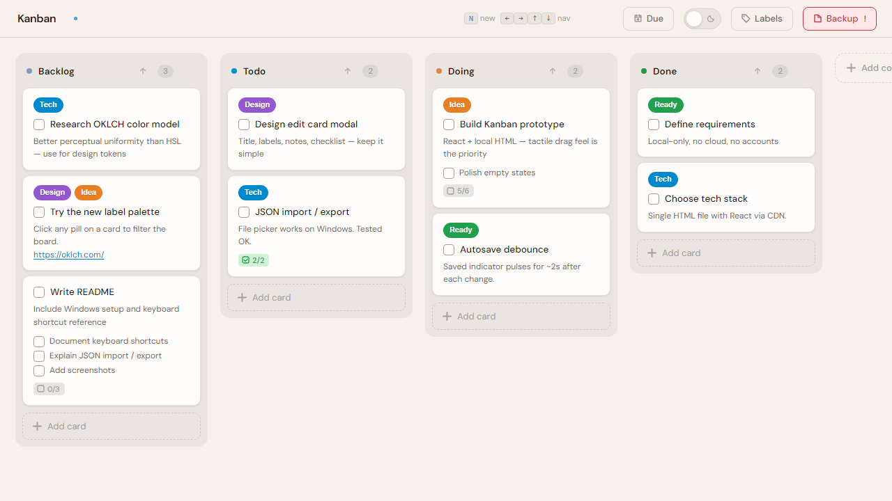
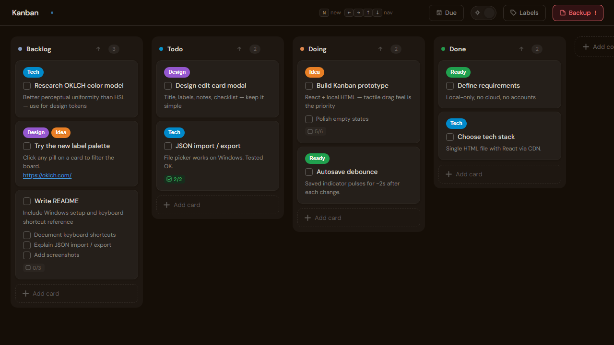

# Tiny Kanban

A tiny, local-first kanban board in one HTML file.

Open `Kanban.html` in a browser and use it directly. No server, account, build step, or cloud sync required.

## What It Does

- Drag cards and columns
- Rename and recolor columns
- Edit cards, notes, labels, checklists, deadlines, and local attachments
- Show unfinished checklist items on card previews
- Reorder checklist items and labels
- Filter by labels
- Sort the whole board or one column by due date
- Import/export board JSON, or start a new blank board
- Optional auto-backup to a local JSON file with a previous-copy backup
- Optional local file/image attachments per card, with image previews when available
- Dark and light themes

## Storage

The board autosaves to browser `localStorage`. For safer storage, use `Backup > Auto Backup` to choose a local JSON backup file.

Local attachments are browser-local file handles. Exported JSON keeps attachment metadata, but another browser or machine may need files re-added.

## Permissions

Auto Backup uses the browser's local file access features.

Your browser will ask for permission to edit the chosen JSON file. Folder-based backup will also ask for access to the backup folder so Tiny Kanban can update the live backup and previous copy. Chrome may describe this as `file:/// can edit the following files and folders`. You can remove this access at any time.

Reloading the page does not affect Auto Backup. Closing the page and opening it again will make the browser re-request permissions to edit the local JSON file. 

Auto Backup is fully optional. If you do not want to grant extra file permissions, the board still autosaves in the browser and manual import/export still works. No additional permissions needed.

## Files

- `Kanban.html` - the app
- `icon.ico` - browser tab icon
- `screenshots/` - README screenshots
- `LICENSE` - project license
- `.gitignore` - ignores local board JSON backups
